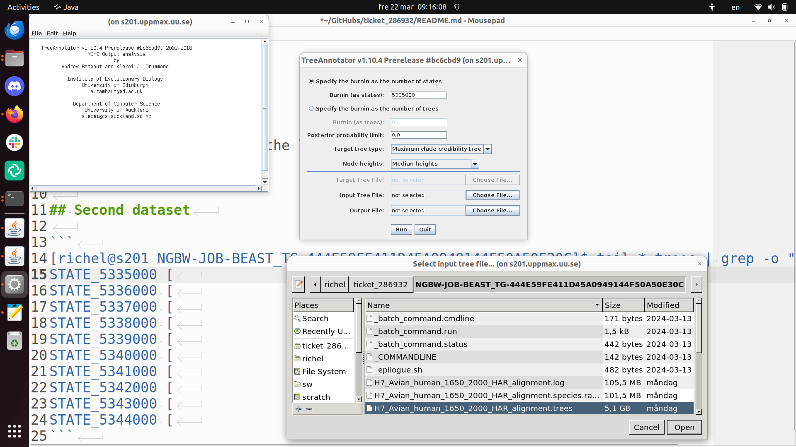
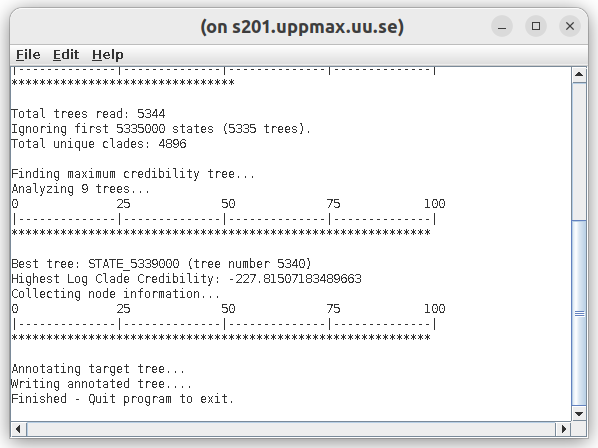
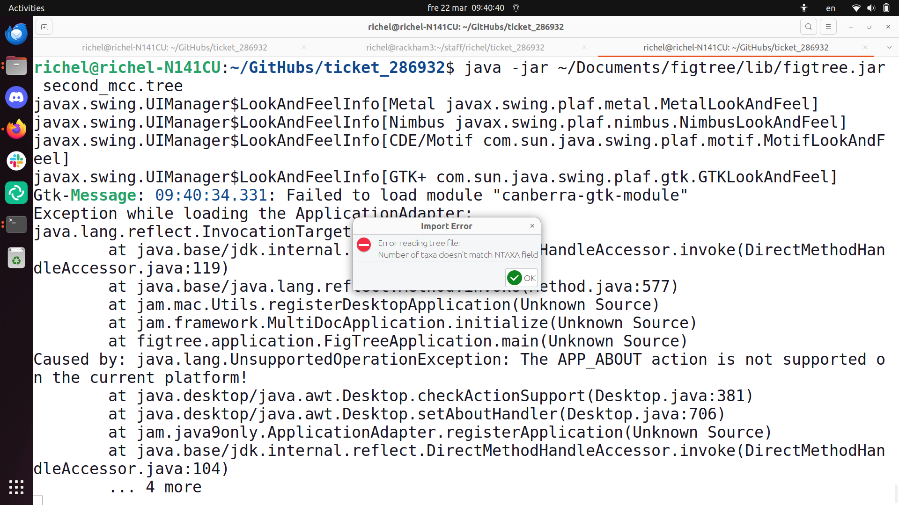
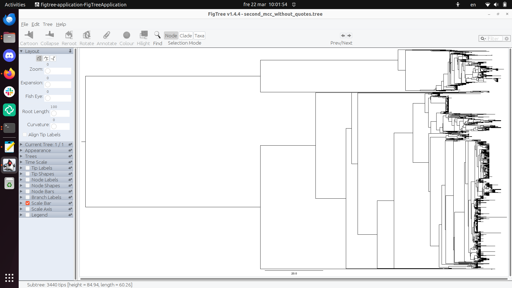

# ticket_286932

Ticket 286932

## Results

 * <first_consensus_tree/first_consensus_tree.tree>: the first MCC consensus tree

 * NEW: <second_mcc.tree>: the second MCC consensus tree


## First dataset

MCC consensus tree, using the last 4 trees:


## Second dataset

```
[richel@s201 NGBW-JOB-BEAST_TG-444E59FE411D45A0949144F50A50E30C]$ tail *.trees | grep -o "STATE_........."
STATE_5335000 [
STATE_5336000 [
STATE_5337000 [
STATE_5338000 [
STATE_5339000 [
STATE_5340000 [
STATE_5341000 [
STATE_5342000 [
STATE_5343000 [
STATE_5344000 [
```

> Finding out the last 10 states



> The setup



> Generating the MCC consensus tree takes 25 minutes

Start FigTree on Linux:

```
java -jar ~/Documents/figtree/lib/figtree.jar second_mcc.tree 
```



> The error message


Quotes:

```
richel@richel-N141CU:~/GitHubs/ticket_286932$ egrep -n "'" second_mcc.tree 
3724:		'692614_chicken_Huai'an_003_2015_H7N9'
3725:		'692615_human_Huai'an_083_2014_H7N9'
3726:		'692620_chicken_Huai'an_007_2014_H7N9'
3727:		'692622_chicken_Huai'an_041_2014_H7N9'
3728:		'692623_chicken_Huai'an_053_2014_H7N9'
3729:		'692627_human_Huai'an_062_2014_H7N9'
3730:		'692628_human_Huai'an_001_2015_H7N9'
3731:		'692629_human_Huai'an_065_2014_H7N9'
3732:		'692631_human_Huai'an_074_2014_H7N9'
3733:		'692632_human_Huai'an_002_2015_H7N9'
8004:		3719 '692614_chicken_Huai'an_003_2015_H7N9',
8005:		3720 '692615_human_Huai'an_083_2014_H7N9',
8006:		3721 '692620_chicken_Huai'an_007_2014_H7N9',
8007:		3722 '692622_chicken_Huai'an_041_2014_H7N9',
8008:		3723 '692623_chicken_Huai'an_053_2014_H7N9',
8009:		3724 '692627_human_Huai'an_062_2014_H7N9',
8010:		3725 '692628_human_Huai'an_001_2015_H7N9',
8011:		3726 '692629_human_Huai'an_065_2014_H7N9',
8012:		3727 '692631_human_Huai'an_074_2014_H7N9',
8013:		3728 '692632_human_Huai'an_002_2015_H7N9',
```

Removing all quotes:


```
cp second_mcc.tree second_mcc_without_quotes.tree 
sed -i "s/'//g" second_mcc_without_quotes.tree 
```

Works:

```
richel@richel-N141CU:~/GitHubs/ticket_286932$ java -jar ~/Documents/figtree/lib/figtree.jar second_mcc_without_quotes.tree 
```



> Works!
