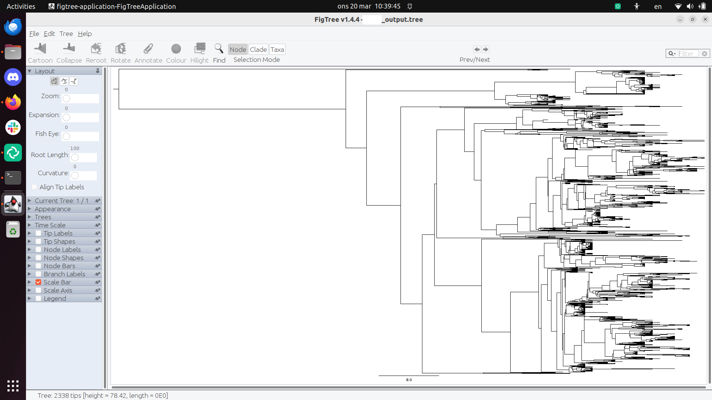

# ticket_286932

Ticket 286932

## First dataset

MCC consensus tree, using the last 4 trees:



## Second dataset

```
[richel@s201 NGBW-JOB-BEAST_TG-444E59FE411D45A0949144F50A50E30C]$ tail *.trees | grep -o "STATE_........."
STATE_5335000 [
STATE_5336000 [
STATE_5337000 [
STATE_5338000 [
STATE_5339000 [
STATE_5340000 [
STATE_5341000 [
STATE_5342000 [
STATE_5343000 [
STATE_5344000 [
```

> Finding out the last 10 states


> The setup


> Generating the MCC consensus tree takes 25 minutes

Start FigTree on Linux:

```
java -jar ~/Documents/figtree/lib/figtree.jar second_mcc.tree 
```


> The error message

